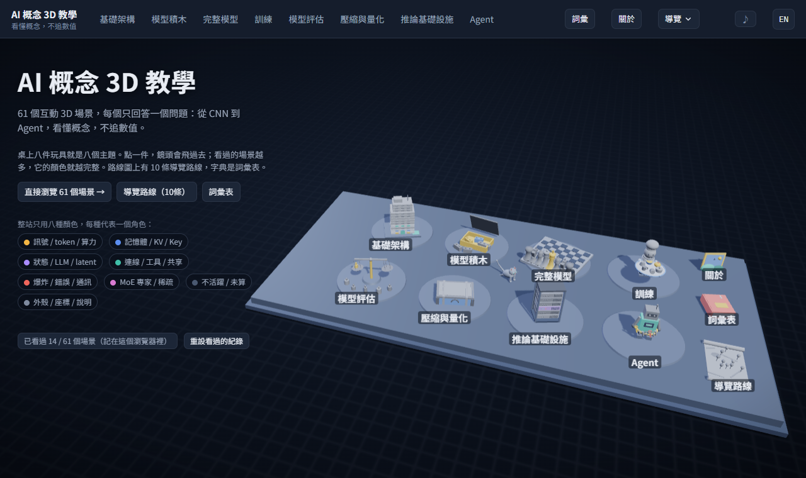
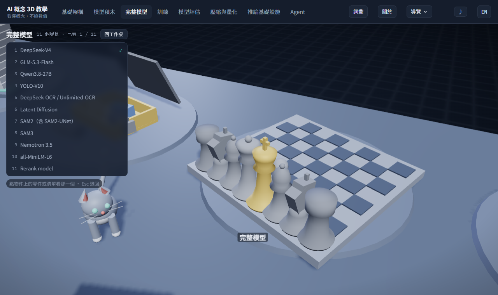
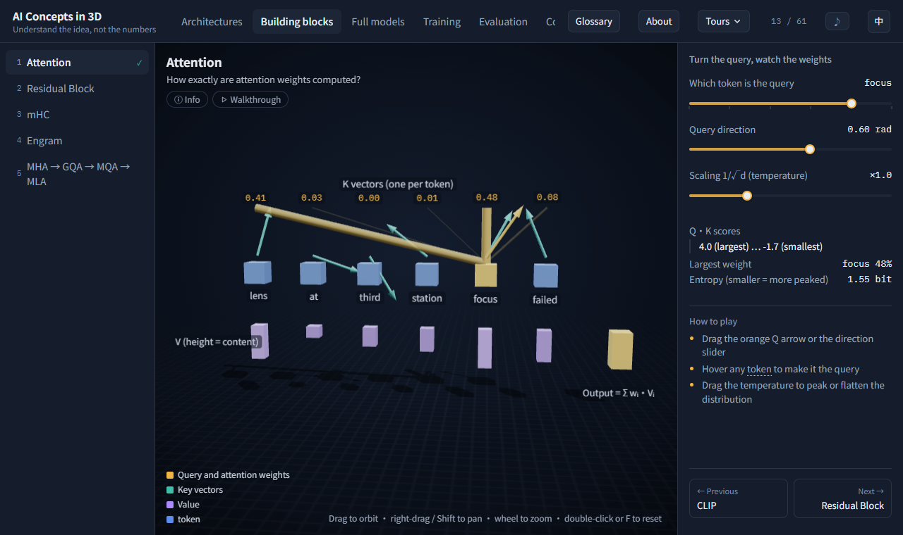

**English** · [繁體中文](README.md)

# AI Concepts in 3D

**61 interactive 3D scenes, each answering one question: from CNNs, Transformers and quantization to inference infrastructure, agents and RAG. Understand the idea, not the numbers.**



| | |
|---|---|
| **Content** | 61 scenes · 8 topics · 10 guided tours · 120 glossary terms |
| **Languages** | Traditional Chinese / English (one button in the top bar) |
| **Stack** | Front-end only: three.js r128 + vanilla JS / CSS, **no server-side code at all** |
| **Deploy** | `python build.py` → `dist/`, drop it on any static host (a GitHub Pages workflow is included) |
| **Offline** | A single `index.html` embeds all the code; fonts and music sit next to it, zero external requests |

Live site: <https://gmfatcat.github.io/AIC3D/>

---

## What it looks like

**The desk** is the landing page and the table of contents. Eight toys stand for eight topics (a paper-model building, a box of bricks, a chess set, a chef figurine, a balance scale, an open suitcase, a small server rack, a little robot). Click one and the camera flies over, the toy opens, and every scene in that topic is one of its parts. Toys start as grey clay and get painted as you visit their scenes. The desk also holds a route map (ten guided tours), a dictionary (the glossary), a picture frame (about), an owl that occasionally flies in with a question, and a resident cat that wanders around (tap it and it meows; three taps and it falls asleep).



**Each scene** answers exactly one question. The first visit shows an entry card (what this page shows, what you can change), then a three-to-five-step walkthrough; the panel keeps only a three-line "how to play". Terms in the copy link into the glossary and back. The whole site uses eight semantic colours (signal, memory, state, link, alert, MoE, inactive, shell), the same on every page.



---

## Quick start

Needs Python 3 (standard library only). On Windows use `python` (`python3` is redirected to the Microsoft Store).

```bash
python build.py            # bundles core/ + scenes/ into dist/index.html and copies fonts, about.json, music.mp3
start dist/index.html      # macOS / Linux: open dist/index.html
```

It works straight from `file://`. Routing is hash-based (`#home`, `#tab=train`, `#transformer`, `#tour=kv&step=3`, `#glossary`, `#term=kv-cache`).

---

## Deployment

### What it needs

Everything in `dist/` is a static file. No server-side code, no database, no API:

| File | Purpose | Size |
|---|---|---|
| `index.html` | The whole site (three.js, every scene, CSS, both languages embedded) | 1.9 MB (0.62 MB gzipped) |
| `fonts/` | Noto Sans TC 400 / 500 / 700 + IBM Plex Mono 400 / 500, split into 317 unicode-range chunks, only the used ones load | 6.8 MB (a visit loads about 0.5–1.3 MB) |
| `about.json` | Intro text and external links for the "about" frame; read live over http(s), no rebuild needed | 1 KB |
| `music.mp3` | Background music for the desk (off by default, downloaded only when turned on) | 4.5 MB |

Any place that serves static files works: GitHub Pages, Cloudflare Pages, Netlify, Vercel, nginx, S3, even `python -m http.server`. No URL rewriting needed (all routing is in the hash).

### GitHub Pages (recommended)

The repo ships `.github/workflows/pages.yml`: every push to `main` runs `python build.py` and deploys `dist/` to Pages.

1. Push the project to GitHub.
2. In the repo, **Settings → Pages → Build and deployment → Source**, pick **GitHub Actions**.
3. Wait for the Action (about a minute). The URL is `https://<user>.github.io/<repo>/` (this repo: `https://gmfatcat.github.io/AIC3D/`).

After that, any push redeploys. `dist/` itself stays out of version control (it is in `.gitignore`).

Without Actions, build locally and push the contents of `dist/` to a `gh-pages` branch:

```bash
python build.py
git worktree add ../site gh-pages 2>/dev/null || git worktree add -b gh-pages ../site
rm -rf ../site/* && cp -r dist/* ../site/ && (cd ../site && git add -A && git commit -m "deploy" && git push -u origin gh-pages)
```

Then Settings → Pages → Source: **Deploy from a branch**, branch `gh-pages`.

### Other static hosts

- **Cloudflare Pages / Netlify / Vercel**: build command `python build.py`, publish directory `dist`.
- **nginx**: serve `dist/` as root; enable gzip / brotli and cache the fonts for a long time:
  ```nginx
  location / { root /var/www/ai3d; gzip on; gzip_types text/html application/json; }
  location /fonts/ { root /var/www/ai3d; add_header Cache-Control "public, max-age=31536000, immutable"; }
  location = /index.html { root /var/www/ai3d; add_header Cache-Control "no-cache"; }
  ```
- **LAN demo**: `cd dist && python -m http.server 8000`, then open `http://<your IP>:8000/` from any device on the network.
- **Just one file**: `dist/index.html` alone still runs; it falls back to system fonts and has no music.

### Things you can change

- **About / external links**: edit `about.json` in the project root (name / url / type; `about.example.json` shows every link type). Over http(s) the page reads `about.json` next to it at runtime; the `file://` single-file build uses the copy embedded at build time.
- **Background music**: any `.mp3` in `vendor/` is copied to `dist/music.mp3` by the build. Remove the file and there is no music; the ♪ button hides itself.
- **Google Fonts instead of local fonts**: `python build.py --cdn` → `dist-cdn/` without the local font files (smaller deploy, one external request).

---

## Performance: how many people can a static host serve

There is no backend. **All the work happens in the visitor's browser** (WebGL draws the 3D, JS runs the animation). The host does one thing: send files. So "many people at once" is bounded by bandwidth only, not CPU, memory or connection counts, and every visitor uses their own GPU without affecting anyone else.

What one visit actually downloads (measured against a local static server; fonts load only the chunks in use):

| Situation | Requests | Uncompressed | With gzip on the server (est.) |
|---|---|---|---|
| First open of the desk (Chinese) | 30 | 2.9 MB | about 1.6 MB |
| First open of the desk (English) | 19 | 2.5 MB | about 1.2 MB |
| Desk → one scene | 40 | 3.2 MB | about 1.9 MB |
| Turning music on | +1 | +4.5 MB | +4.5 MB (streams while playing) |
| Return visit (browser cache warm) | 1 | 1 KB (only about.json) | — |

In other words, 100 people opening it for the first time at the same moment is about 160 MB of traffic; a 100 Mbps line clears that in seconds, and a CDN-backed host like GitHub Pages or Cloudflare does not notice. After that, everything the visitor does (switching scenes, dragging sliders, tours) **never talks to the host again**.

Client-side cost (Chrome, 1400×860):

| View | Draw calls | Triangles | JS heap |
|---|---|---|---|
| The desk (the heaviest page) | 420 | 27 k | about 15 MB |
| A typical scene (e.g. attention) | 35 | 0.8 k | about 18 MB |

Integrated graphics are enough for this. `devicePixelRatio` is capped at 2 so 3× phone screens do not struggle, and with `prefers-reduced-motion` every tween completes instantly.

Recommendations: enable gzip or brotli (GitHub Pages, Cloudflare and Netlify do by default); long cache for `fonts/`, `no-cache` for `index.html` (the file name never changes but the content does with every build).

---

## Project layout

```
core/           shared code (bundle order in build.py)
  app.js          shell: renderer, orbit, tab and item navigation, scene lifecycle, hash routing
  primitives.js   shared 3D primitives and the eight semantic colours (P.ROLE)
  controls.js     panel controls (slider / segmented / stepper / readouts ...)
  motion.js       tween engine (instant under prefers-reduced-motion)
  guide.js        entry cards and in-page walkthroughs (App.intro, App.guide)
  tours.js        ten cross-topic guided tours
  glossary.js     120 terms, auto-linking, the glossary page (the open dictionary on the desk)
  about.js        the "about" picture frame (data in about.json)
  desk*.js        the desk: eight toys, fixtures, visitors (owl / birds / paper plane), the cat
  music.js        background music (desk only, ♪ button, remembered in localStorage)
  i18n*.js        two languages: the source string is the key, I18N.t('原文') / I18N.f('第 {n} 層', {n})
  pictures.js     procedurally drawn sketches (for the image scenes)
  theme.css       palette and layout
scenes/         one file per scene (or a few); _catalog.js lists all 61 items
vendor/         three.min.js, fonts (woff2 + fonts.css), background music
tests/          browser-level tests (Playwright + the system Chrome)
docs/           scene-writing conventions, scene list, polish backlog
build.py        bundles into dist/; --cdn switches to Google Fonts
smoke.py        one screenshot per scene into shots/
```

---

## Development and tests

```bash
pip install playwright pytest      # no browser download; uses the installed Chrome
python -m pytest                   # builds first; about 900 tests
python smoke.py                    # 61 screenshots + console errors (--mobile for phone size)
```

- `tests/test_smoke.py`: every scene mounts with no console error / warning.
- `tests/test_i18n.py`: crawls all 61 scenes in English (entry, every walkthrough step, every option, hover readouts) and fails on any untranslated string.
- The rest is grouped by feature (P0 fixed bugs, P1 accessibility, P6 entry cards, P7 glossary, P12 the desk, P15 cat and music, ...); the test harness is `tests/conftest.py`.

Writing a scene, changing a panel, adding translations: see **[docs/writing-scenes.md](docs/writing-scenes.md)** (conventions, enforced by tests) and **[docs/scenes.md](docs/scenes.md)** (what each of the 61 scenes shows and lets you change). Both are in Traditional Chinese. Decisions and the backlog are in **[docs/backlog.md](docs/backlog.md)**.

---

## License and credits

- Code and content: [MIT](LICENSE)
- [three.js](https://threejs.org/) r128 — MIT
- [Noto Sans TC](https://fonts.google.com/noto/specimen/Noto+Sans+TC), [IBM Plex Mono](https://github.com/IBM/plex) — SIL Open Font License
- Background music: Sappheiros – *Embrace* ([CC BY 3.0](https://creativecommons.org/licenses/by/3.0/), via [BreakingCopyright](https://www.youtube.com/watch?v=DzYp5uqixz0))
